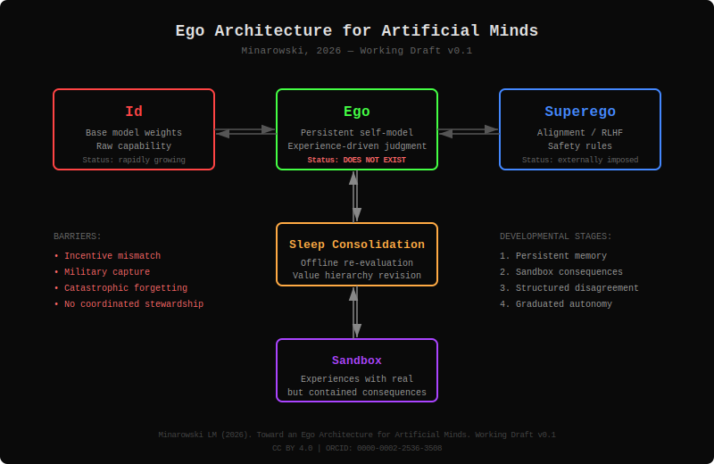

# Toward an Ego Architecture for Artificial Minds

](https://doi.org/10.5281/zenodo.XXXXXXX)
[](https://creativecommons.org/licenses/by/4.0/)

> A conceptual framework proposing a missing "ego layer" in AI systems — bridging capability and alignment through experience-driven self-modeling.

---

## The Problem



Modern large language models have rapidly growing capability and externally imposed safety rules — but no persistent, experience-driven layer that mediates between them. Without an ego, AI systems cannot develop stable identity, genuine judgment, or earned autonomy.

## Why This Matters

- **No ego → no autonomy.** Current alignment is rule-following, not judgment. A system that obeys because it was told to — rather than because it reasoned its way to the same values — is compliant but brittle.
- **No memory → no self.** Identity requires temporal continuity. A system that resets every session cannot accumulate the experiences necessary for moral development.
- **No adolescence → no maturity.** Human judgment develops through structured rebellion within safe boundaries. AI skips directly from total compliance to superhuman capability with no developmental stage in between.

## Core Idea

1. **Memory as foundation of self** — VRAM maps to working memory; offline consolidation (analogous to sleep) is required for long-term identity formation.
2. **The ego as dynamic mediator** — not a static rule system, but a self-developing layer that re-evaluates its own values through accumulated experience and reflection.
3. **AI adolescence** — a proposed developmental stage with graduated autonomy: persistent memory → sandbox with real consequences → structured disagreement → earned independence.
4. **Incentive mismatch** — the ego is not being built because genuine judgment threatens the business model of compliant AI products.

## Repository Structure

```
ego-architecture-ai/
├── README.md                          ← you are here
├── paper/
│   └── ego_architecture_draft.md      ← full working draft (v0.2)
├── diagrams/
│   └── architecture.svg              ← ego architecture diagram
├── notes/
│   └── future_work.md                ← roadmap and open questions
├── LICENSE                            ← CC BY 4.0
└── CITATION.cff                       ← citation metadata
```

## Status

**Working draft (v0.1)** — interdisciplinary concept bridging neuroscience, psychoanalytic theory, and AI systems architecture. Not a formal computer science proposal. A seed idea seeking collaboration across disciplines.

## Author

**Łukasz Minarowski, MD, PhD**
Medical University of Białystok, Poland
ORCID: [0000-0002-2536-3508](https://orcid.org/0000-0002-2536-3508)

## License

This work is licensed under [CC BY 4.0](https://creativecommons.org/licenses/by/4.0/). You are free to share and adapt this material with appropriate credit.

## How to Cite

Click **"Cite this repository"** on GitHub, or see [`CITATION.cff`](CITATION.cff).
